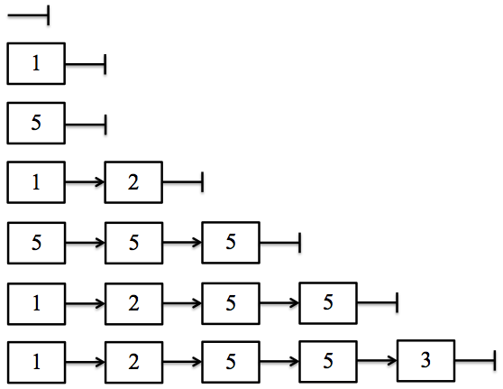

# Linked List Remove Nodes

_source [Programming Interview Questions 5: Linked List Remove Nodes](http://www.ardendertat.com/2011/09/29/programming-interview-questions-5-linkedlist-remove-nodes/)_

This is a very fundamental question and it’s tricky to implement without any bugs. Given a linkedlist of integers and an integer value, delete every node of the linkedlist containing that value.

There are many corner cases to consider, here are some. The value to remove is 5.



Inputs are the head of the linked list and the integer value to remove. The most important corner case occurs when the element to delete is at the head of the linkedlist. So the caller’s head pointer should be updated. Because of this, our function should take the head either as a pointer to pointer or pass by reference (or we can also return the new head pointer back to the caller). Otherwise the changes won’t be seen by the caller. I personally prefer pass by reference since it leads to cleaner code.

Let’s say we want to remove all the nodes with the value 5. The solution is first we remove all consecutive fives in the beginning of the linkedlist, and update the head accordingly to point to the first element other than 5 (can be null as well). Then we begin a loop and check the next node whether its value is 5. If it isn’t then we advance the pointer to the next node and continue. If it is 5 then we modify the next pointers accordingly and delete the next note. But we don’t advance our pointer, this is very important. Because the new next node could also contain the value 5, and if we advance the pointer we won’t be able to delete it. This is a subtle corner case which occurs when two or more consecutive nodes should be deleted. Here is the C code:

```C
typedef struct Node{
    int val;
    Node *next;
} Node;

void removeNodes(Node* &amp;head, int rmv)
{
    while (head!=NULL &amp;&amp; head-&gt;val==rmv)
    {
        Node *temp=head;
        head=head-&gt;next;
        free(temp);
    }
    if (head==NULL)
        return;

    Node *current=head;
    while (current-&gt;next!=NULL)
    {
        if (current-&gt;next-&gt;val==rmv)
        {
            Node *temp=current-&gt;next;
            current-&gt;next=temp-&gt;next;
            free(temp);
        }
        else
        {
            current=current-&gt;next;
        }
    }
}
```

The time complexity is O(N) and space complexity is O(1), which is optimal. I especially like this interview question because it demonstrates fundamental concepts and it’s not easy to code bug free.

