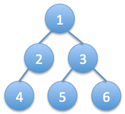

# Tree Level Order Print

_source [Programming Interview Questions 20: Tree Level Order Print](http://www.ardendertat.com/2011/12/05/programming-interview-questions-20-tree-level-order-print/)_

Given a binary tree of integers, print it in level order. The output will contain space between the numbers in the same level, and new line between different levels. For example, if the tree is:




The output should be:
1
2 3
4 5 6

It won’t be practical to solve this problem using recursion, because recursion is similar to depth first search, but what we need here is breadth first search. So we will use a queue as we did previously in breadth first search. First, we’ll push the root node into the queue. Then we start a while loop with the condition queue not being empty. Then, at each iteration we pop a node from the beginning of the queue and push its children to the end of the queue. Once we pop a node we print its value and space.

To print the new line in correct place we should count the number of nodes at each level. We will have 2 counts, namely current level count and next level count. Current level count indicates how many nodes should be printed at this level before printing a new line. We decrement it every time we pop an element from the queue and print it. Once the current level count reaches zero we print a new line. Next level count contains the number of nodes in the next level, which will become the current level count after printing a new line. We count the number of nodes in the next level by counting the number of children of the nodes in the current level. Understanding the code is easier than its explanation:

```python
class Node:
    def __init__(self, val=None):
        self.left, self.right, self.val = None, None, val

def levelOrderPrint(tree):
    if not tree:
        return
    nodes=collections.deque([tree])
    currentCount, nextCount = 1, 0
    while len(nodes)!=0:
        currentNode=nodes.popleft()
        currentCount-=1
        print currentNode.val,
        if currentNode.left:
            nodes.append(currentNode.left)
            nextCount+=1
        if currentNode.right:
            nodes.append(currentNode.right)
            nextCount+=1
        if currentCount==0:
            #finished printing current level
            print '\n',
            currentCount, nextCount = nextCount, currentCount

```

The time complexity of this solution is O(N), which is the number of nodes in the tree, so it’s optimal. Because we should visit each node at least once. The space complexity depends on maximum size of the queue at any point, which is the most number of nodes at one level. The worst case occurs when the tree is a complete binary tree, which means each level is completely filled with maximum number of nodes possible. In this case, the most number of nodes appear at the last level, which is (N+1)/2 where N is the total number of nodes. So the space complexity is also O(N). Which is also optimal while using a queue.

This is one of the most common tree interview questions and everyone should know it off the top of their head.
