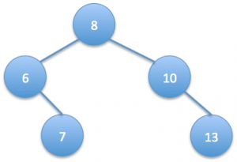

# Trim Binary Search Tree

_source [Programming Interview Questions 26: Trim Binary Search Tree](http://www.ardendertat.com/2012/01/17/programming-interview-questions-26-trim-binary-search-tree/)_

Given the root of a binary search tree and 2 numbers min and max, trim the tree such that all the numbers in the new tree are between min and max (inclusive). The resulting tree should still be a valid binary search tree. So, if we get this tree as input:


and we’re given min value as 5 and max value as 13, then the resulting binary search tree should be:



We should remove all the nodes whose value is not between min and max. We can do this by performing a post-order traversal of the tree. We first process the left children, then right children, and finally the node itself. So we form the new tree bottom up, starting from the leaves towards the root. As a result while processing the node itself, both its left and right subtrees are valid trimmed binary search trees (may be NULL as well).

At each node we’ll return a reference based on its value, which will then be assigned to its parent’s left or right child pointer, depending on whether the current node is left or right child of the parent. If current node’s value is between min and max (min<=node<=max) then there’s no action need to be taken, so we return the reference to the node itself. If current node’s value is less than min, then we return the reference to its right subtree, and discard the left subtree. Because if a node’s value is less than min, then its left children are definitely less than min since this is a binary search tree. But its right children may or may not be less than min we can’t be sure, so we return the reference to it. Since we’re performing bottom-up post-order traversal, its right subtree is already a trimmed valid binary search tree (possibly NULL), and left subtree is definitely NULL because those nodes were surely less than min and they were eliminated during the post-order traversal. Remember that in post-order traversal we first process all the children of a node, and then finally the node itself.

Similar situation occurs when node’s value is greater than max, we now return the reference to its left subtree. Because if a node’s value is greater than max, then its right children are definitely greater than max. But its left children may or may not be greater than max. So we discard the right subtree and return the reference to the already valid left subtree. The code is easier to understand:

```python
def trimBST(tree, minVal, maxVal):
    if not tree:
        return
    tree.left=trimBST(tree.left, minVal, maxVal)
    tree.right=trimBST(tree.right, minVal, maxVal)
    if minVal<=tree.val<=maxVal:
        return tree
    if tree.val<minVal:
        return tree.right
    if tree.val>maxVal:
        return tree.left
```

The complexity of this algorithm is O(N), where N is the number of nodes in the tree. Because we basically perform a post-order traversal of the tree, visiting each and every node one. This is optimal because we should visit every node at least once. This is a very elegant question that demonstrates the effectiveness of recursion in trees.

